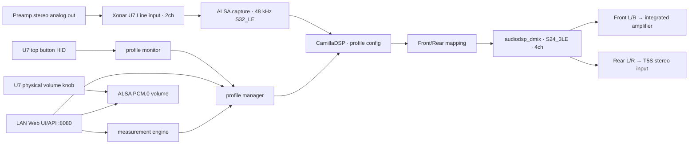

# AudioDSP 아키텍처

## 전체 구성



## 프로세스와 책임

| 구성 | 설치 파일 | 책임 |
|---|---|---|
| CamillaDSP | `/usr/local/bin/camilladsp` | 48 kHz 실시간 FIR, mixer, 4채널 출력 |
| 시작 래퍼 | `/usr/local/bin/audiodsp-camilladsp-start` | U7 탐색, Line 입력 선택, 저장 볼륨 복원, runtime config 치환 |
| 프로필 관리자 | `/usr/local/bin/audiodsp-profile-manager.py` | 설정 정규화, fallback, YAML 생성·검사·원자 교체, FIR 설치/preview/복구, 볼륨 저장·적용 |
| HID 감시 | `/usr/local/bin/audiodsp-profile-monitor.py` | U7 Speaker/Headphones 실제 상태를 read-only GET_REPORT로 읽기, 버튼/부팅 report를 분리 해석, 프로필 전환, 안내음 요청 |
| 출력 전환 helper | `/usr/local/bin/audiodsp-output-profile` | manager 호출과 Front L/R 안내음 믹스 |
| 웹 | `/usr/local/bin/audiodsp-profile-web.py` | 세 화면, HTTP API, staged upload/backup, client SVG, 실제 볼륨 polling |
| 측정 엔진 | `/usr/local/bin/audiodsp-measurement.py` | 독점 측정, L/R/우퍼·합산 closure·동시 Walsh 위상, ESS/SNR 분석, 공통 레벨/공통 bank gain FIR 계산, 진행 상태 |
| MIMO 엔진 | `/usr/local/bin/audiodsp-mimo.py` | Pi4/5와 공통 timing reference 조건의 2×4 robust pressure matching, 8-path FIR bank와 영구 한계 보고서 생성 |
| 준비 안내 | `/usr/local/bin/audiodsp-dsp-ready` | CamillaDSP 준비 확인 후 `DSP ready` 재생 |

모든 서비스는 root로 동작한다. 이는 ALSA/HID, `/etc/camilladsp`, systemd 제어에 필요한 현재 설계 선택이며, 웹이 인증 없는 LAN 서비스라는 점과 함께 보안 경계를 결정한다.

## 오디오 토폴로지

입력은 U7 Line L/R 두 채널이다. 출력은 U7 device 0의 첫 네 채널이며 Front L/R은 인티앰프, Rear L/R은 T5S 서브우퍼의 stereo 입력으로 연결한다.

- `copy_front`: L/R을 각각 한 번 convolution한 뒤 Front와 Rear로 복사한다. convolution 2개다.
- `separate`: 입력을 Front/Rear로 복제한 뒤 각 L/R에 Front와 Rear FIR을 별도로 적용한다. convolution 4개다.
- `bypass`: convolution 없이 입력 L/R을 Front/Rear에 복사한다.
- `mimo_2x4`: 입력을 8개 경로로 펼쳐 각 물리 출력마다 L/R 전달 FIR을 적용하고 네 출력으로 합산한다. Pi4/5, chunksize 1024 이상, 검증된 공통 timing reference가 모두 필요하다.
- Rear FIR이 없으면 설정이 `separate`여도 유효 모드는 `copy_front`다.

안내 WAV는 4채널 공유 dmix에 재생되지만 음성 샘플은 Front L/R에만 있고 Rear L/R은 무음이다.

## 설정 해석

`profile-settings.json`의 주요 필드:

```json
{
  "requested_profile": "speaker",
  "chunksize": 2048,
  "output_volume_db": -10,
  "bypass": {"speaker": false, "headphone": false},
  "mimo_enabled": {"speaker": false, "headphone": false},
  "rear_mode": {"speaker": "copy_front", "headphone": "copy_front"},
  "woofer_trim_db": {"speaker": 0, "headphone": 0}
}
```

MIMO bank는 `/etc/camilladsp/profiles/mimo`의 manifest와 네 stereo float32 WAV로 관리한다. manifest의 네 WAV는 각기 입력 L/R→물리 출력 한 개의 두 경로이며 총 convolution은 8개다. T5S 한 대의 stereo 입력은 `sub_pair` 하나의 물리 제어원으로 측정하고 Rear L/R에 0.5씩 복제한다.

전체 수식, 연구 근거, 측정 절차와 필터/물리 한계 분류는 `docs/MIMO_ROOM_TUNING.md`를 기준으로 한다.

선택 프로필에 Front FIR이 있거나 bypass가 켜져 있으면 그대로 사용한다. 아니면 다른 프로필을 변경 없이 사용하고, 그것도 없으면 Factory Front를 사용한다. fallback은 파일을 복사하거나 선택값을 고쳐 쓰지 않고 runtime 해석 결과에만 나타난다.

## 상태와 동시성

- 관리자 CLI는 `/run/audiodsp-profile-manager.lock`의 `flock`으로 설정·FIR·config 변경을 직렬화한다.
- 측정은 별도 measurement lock과 audio-exclusive lock을 쓴다.
- 정밀 분리+합산 session은 L/R/W magnitude로 branch를 설계하고 L+W/R+W의 절대 전달 closure와 same-recording L+R+W Walsh 상대위상을 cross-term 제약으로 사용한다. 합산 응답을 branch로 다시 평균하거나 normalize하지 않는다.
- 여러 위치의 음향 prototype과 fractional-octave 응답 smoothing은 noise-confidence weighted 평균제곱 전달응답을 사용한다. filter gain과 cut-only 합산 guard는 dB-domain smoothing으로 분리하며 response revision이 다르면 원본 WAV 재계산을 요구한다.
- L/R의 500~2,000 Hz로 하나의 측정·타깃 0 dB 기준을 만든다. 완성된 Front L/R·Woofer L/R bank에는 한 common gain만 적용하며, 독립 branch normalization은 자동 core check와 matrix test가 차단한다.
- Front 자동 감쇄의 절대 한도는 UI의 `최대 룸 감쇄` 하나뿐이다. 500 Hz 이상은 측정 SNR, 위치 편차, 1/6옥타브 이웃 대비 peak 폭, 독립 L/R 타깃 초과의 일치도를 연속 신뢰도로 곱하며 주파수별 3/6 dB 고정 상한은 두지 않는다.
- JSON과 config는 임시 파일 작성 후 `os.replace`로 원자 교체한다.
- Web은 thread-per-request지만 모든 변경은 관리자 CLI의 프로세스 lock을 통과한다.
- status는 관련 파일 mtime/size signature로 cache한다.
- U7 볼륨은 2.5초 cache하며 UI는 화면이 보일 때 약 3초마다 조회한다.

## 볼륨 제어

U7 `PCM Playback Volume`은 raw 0~127, -127~0 dB이며 8개 재생 채널을 가진다. AudioDSP API는 사용 실수를 줄이기 위해 -60~0 dB만 허용하고 `raw = 127 + dB`로 쓴다. 웹/API 쓰기는 JSON에 저장한 뒤 하드웨어에 즉시 적용한다. 하드웨어 쓰기가 실패해도 저장값은 유지되고 다음 CamillaDSP 시작 시 시작 래퍼가 다시 적용한다.

측정 dBFS는 평상시 청취 볼륨과 독립된 U7 DAC 기준이다. 모든 audible measurement window는 오디오 전용 lock을 잡고 CamillaDSP와 U7 Mic/Line 입력을 먼저 끈 다음 8개 PCM 채널을 0 dB로 맞춰 read-back한다. 마지막 sweep/녹음 프로세스를 종료한 뒤 저장해 둔 동일 8채널 볼륨을 복원·read-back한 경우에만 Line/CamillaDSP 입력을 다시 연결한다. 복원 실패는 silent fail-closed이며 같은 lock 동안 manager mutation은 거부된다.

실제값과 저장값은 구분된다. 물리 노브 변경은 실제값에 즉시 나타나지만 저장 JSON은 바꾸지 않는다. 따라서 재부팅·USB reset 후 마지막 웹/API 저장값으로 복원된다.

## 부팅 순서

1. 최초 부팅의 `firstrun.sh`가 계정, hostname, payload, calibration, target, systemd unit을 설치한다.
2. 초기 Speaker profile과 플랫폼 chunksize를 저장하고 measurement FFTW self-test를 실행한다.
3. 재부팅 후 NetworkManager DHCP 프로필, CamillaDSP, HID monitor, Web UI가 시작된다.
4. 시작 래퍼가 U7을 찾고 입력 source와 저장 볼륨을 적용한다.
5. CamillaDSP가 안정적으로 살아 있으면 준비 서비스가 `DSP ready`를 Front L/R에 믹스한다.

Pi별 부팅·네트워크 차이는 `platform` 문서를 따른다.
