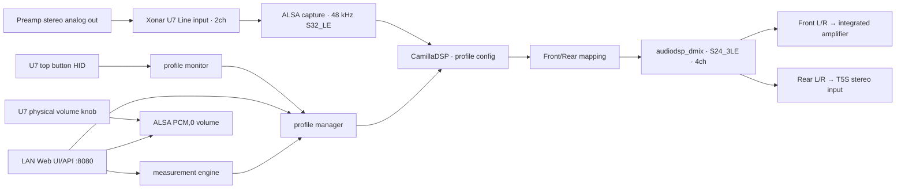

# AudioDSP 아키텍처

## 전체 구성



## 프로세스와 책임

| 구성 | 설치 파일 | 책임 |
|---|---|---|
| CamillaDSP | `/usr/local/bin/camilladsp` | 48 kHz 실시간 FIR, mixer, 4채널 출력 |
| 시작 래퍼 | `/usr/local/bin/audiodsp-camilladsp-start` | U7 탐색, Line 입력 선택, 저장 볼륨 복원, runtime config 치환 |
| 프로필 관리자 | `/usr/local/bin/audiodsp-profile-manager.py` | 설정 정규화, fallback, YAML 생성·검사·원자 교체, FIR 설치/preview/복구, 볼륨 저장·적용 |
| HID 감시 | `/usr/local/bin/audiodsp-profile-monitor.py` | U7 Speaker/Headphones 실제 상태 읽기, 프로필 전환, 안내음 요청 |
| 출력 전환 helper | `/usr/local/bin/audiodsp-output-profile` | manager 호출과 Front L/R 안내음 믹스 |
| 웹 | `/usr/local/bin/audiodsp-profile-web.py` | 세 화면, HTTP API, staged upload/backup, client SVG, 실제 볼륨 polling |
| 측정 엔진 | `/usr/local/bin/audiodsp-measurement.py` | 독점 측정, 개별 SNR, sweep/EDT/T20 분석, 공간 결합, 실제 FIR FFT 셀프검증, 진행 상태 |
| 준비 안내 | `/usr/local/bin/audiodsp-dsp-ready` | CamillaDSP 준비 확인 후 `DSP ready` 재생 |

모든 서비스는 root로 동작한다. 이는 ALSA/HID, `/etc/camilladsp`, systemd 제어에 필요한 현재 설계 선택이며, 웹이 인증 없는 LAN 서비스라는 점과 함께 보안 경계를 결정한다.

## 오디오 토폴로지

입력은 U7 Line L/R 두 채널이다. 출력은 U7 device 0의 첫 네 채널이며 Front L/R은 인티앰프, Rear L/R은 T5S 서브우퍼의 stereo 입력으로 연결한다.

- `copy_front`: L/R을 각각 한 번 convolution한 뒤 Front와 Rear로 복사한다. convolution 2개다.
- `separate`: 입력을 Front/Rear로 복제한 뒤 각 L/R에 Front와 Rear FIR을 별도로 적용한다. convolution 4개다.
- `bypass`: convolution 없이 입력 L/R을 Front/Rear에 복사한다.
- Rear FIR이 없으면 설정이 `separate`여도 유효 모드는 `copy_front`다.

안내 WAV는 4채널 공유 dmix에 재생되지만 음성 샘플은 Front L/R에만 있고 Rear L/R은 무음이다.

## 설정 해석

`profile-settings.json`의 주요 필드:

```json
{
  "requested_profile": "speaker",
  "chunksize": 2048,
  "output_volume_db": -10,
  "bypass": {"speaker": false, "headphone": false},
  "rear_mode": {"speaker": "copy_front", "headphone": "copy_front"},
  "woofer_trim_db": {"speaker": 0, "headphone": 0}
}
```

선택 프로필에 Front FIR이 있거나 bypass가 켜져 있으면 그대로 사용한다. 아니면 다른 프로필을 변경 없이 사용하고, 그것도 없으면 Factory Front를 사용한다. fallback은 파일을 복사하거나 선택값을 고쳐 쓰지 않고 runtime 해석 결과에만 나타난다.

## 상태와 동시성

- 관리자 CLI는 `/run/audiodsp-profile-manager.lock`의 `flock`으로 설정·FIR·config 변경을 직렬화한다.
- 측정은 별도 measurement lock과 audio-exclusive lock을 쓴다.
- 측정 재생은 검증된 `audiodsp_announce` 4채널 공유 ALSA 경로를 쓰되 CamillaDSP는 중지되어 FIR을 완전히 bypass한다.
- JSON과 config는 임시 파일 작성 후 `os.replace`로 원자 교체한다.
- Web은 thread-per-request지만 모든 변경은 관리자 CLI의 프로세스 lock을 통과한다.
- Profile WAV staging은 thread lock, 전체 백업 복원은 별도 re-entrant lock으로 직렬화한다. 복원 검토 디렉터리는 관리 루트 경계를 resolve하고 symbolic link를 따라가지 않은 뒤 적용·교체·취소·검증 실패 시 회수한다.
- status는 관련 파일 mtime/size signature로 cache한다.
- U7 볼륨은 2.5초 cache하며 UI는 화면이 보일 때 약 3초마다 조회한다.
- 측정 worker는 state lock 안에서 launch/PID 기록을 직렬화하고 PID와 `/proc` command line을 함께 검증한다. 사라진 worker는 디스크 session을 조회만으로 바꾸지 않은 채 API 응답에서 중단 오류로 복구한다.

## 볼륨 제어

U7 `PCM Playback Volume`은 raw 0~127, -127~0 dB이며 8개 재생 채널을 가진다. AudioDSP API는 사용 실수를 줄이기 위해 -60~0 dB만 허용하고 `raw = 127 + dB`로 쓴다. 웹/API 쓰기는 JSON에 저장한 뒤 하드웨어에 즉시 적용한다. 하드웨어 쓰기가 실패해도 저장값은 유지되고 다음 CamillaDSP 시작 시 시작 래퍼가 다시 적용한다.

실제값과 저장값은 구분된다. 물리 노브 변경은 실제값에 즉시 나타나지만 저장 JSON은 바꾸지 않는다. 따라서 재부팅·USB reset 후 마지막 웹/API 저장값으로 복원된다.

## 부팅 순서

1. 최초 부팅의 `firstrun.sh`가 계정, hostname, payload, calibration, target, systemd unit을 설치한다.
2. 초기 Speaker profile과 플랫폼 chunksize를 저장하고 measurement FFTW self-test를 실행한다.
3. 재부팅 후 NetworkManager DHCP 프로필, CamillaDSP, HID monitor, Web UI가 시작된다.
4. 시작 래퍼가 U7을 찾고 입력 source와 저장 볼륨을 적용한다.
5. CamillaDSP가 안정적으로 살아 있으면 준비 서비스가 `DSP ready`를 Front L/R에 믹스한다.

Pi별 부팅·네트워크 차이는 `platform` 문서를 따른다.
